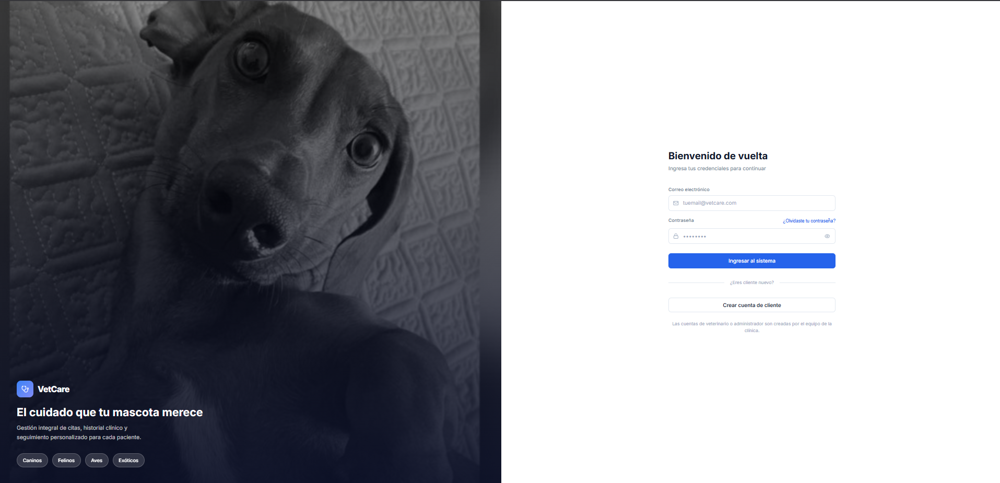
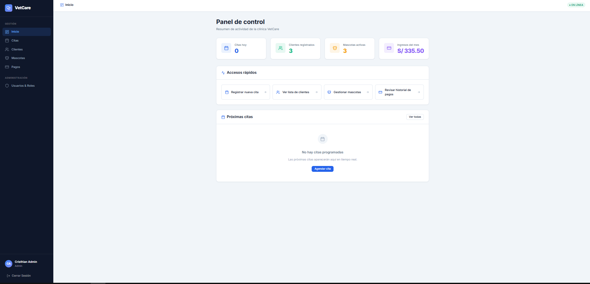
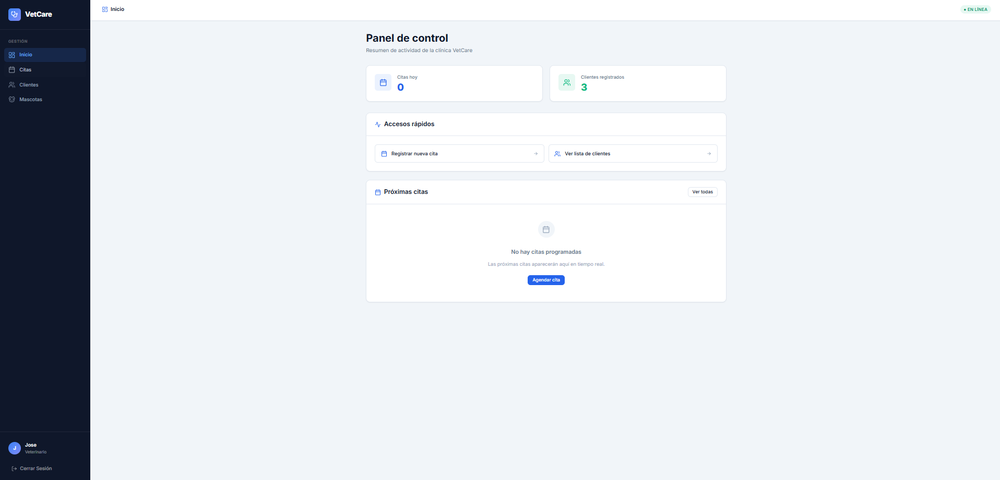
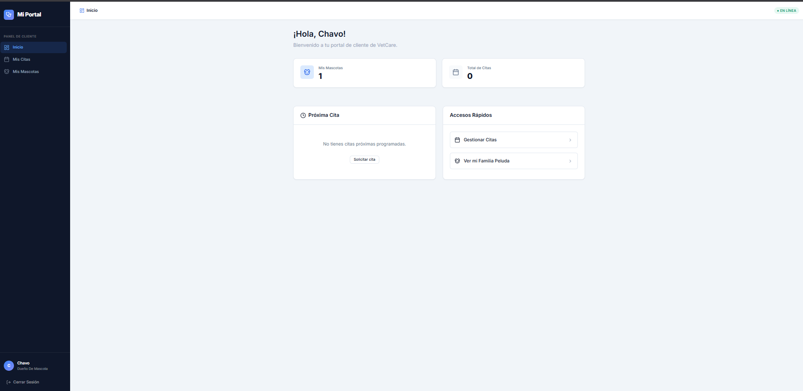

#  Sistema VetCare

Plataforma backend diseñada para centralizar, automatizar y optimizar los procesos operativos y administrativos de una clínica veterinaria.

[](https://nodejs.org/)
[](https://expressjs.com/)
[](https://www.mysql.com/)
[]()

**Universidad Nacional Jorge Basadre Grohmann (UNJBG)**
*Facultad de Ingeniería - Escuela Profesional de Ingeniería en Informática y Sistemas*
Proyecto Final - Diseño de Sistemas | Tacna, 2026

## Equipo de Desarrollo

* Luis David Cruz Llica
* Jose Antonio Vilcanqui Chambi
* Cristian Chura Peralta

## Resumen del Proyecto

El sistema asegura la integridad de los datos médicos y financieros mediante una arquitectura robusta, garantizando escalabilidad y seguridad en las transacciones de la clínica.

**Alcance Funcional (Módulos Principales)**
* **Autenticación y Seguridad:** Control de acceso basado en roles (Admin, Veterinario, Cliente) utilizando tokens transaccionales (JWT).
* **Portal del Cliente:** Interfaz para que los clientes reserven citas y paguen mediante billeteras digitales (Yape/Plin).
* **Clientes y Mascotas:** Gestión relacional de perfiles de dueños y vinculación de expedientes de pacientes (con avatares).
* **Citas Médicas:** Agendamiento interactivo y seguimiento de consultas veterinarias.
* **Historial Clínico:** Registro inmutable de diagnósticos, peso, temperatura y tratamientos aplicados.
* **Pagos y Facturación:** Procesamiento, reportes estadísticos en vivo y distribución de ingresos por método de pago.

## Arquitectura y Stack Tecnológico

El proyecto es un sistema **Full Stack** separado en dos capas principales: una API RESTful y una aplicación web tipo SPA (Single Page Application).

| Tecnología | Propósito en el Sistema |
| :--- | :--- |
| **React + Vite** | Framework frontend para la interfaz de usuario ultrarrápida. |
| **Node.js + Express** | Entorno de servidor y enrutamiento de la API REST. |
| **MySQL2** | Motor de base de datos relacional. |
| **JWT & Bcrypt** | Generación de tokens de seguridad y encriptación de contraseñas. |
| **Lucide React** | Sistema de iconografía vectorial profesional. |

##  Instalación y Despliegue Local (Demo)

Siga los pasos a continuación para inicializar el entorno de desarrollo en su máquina local:

### 1. Clonación del Repositorio
```bash
git clone https://github.com/Cristhian-Ch/VetCare.git
```
### 2. Configuración de Variables de Entorno

Cree un archivo denominado .env en la raíz del directorio backend con la siguiente estructura:
```
PORT=3000
DB_HOST=localhost
DB_USER=root
DB_PASSWORD=su_contraseña_de_mysql
DB_NAME=vetcare_db
JWT_SECRET=clave_criptografica_secreta_vetcare
```
### 3. Preparación de la Base de Datos

Inicie su servidor MySQL local.

Utilice un cliente SQL para crear la base de datos vetcare_db.

Ejecute los scripts DDL provistos en el proyecto para inicializar las tablas.

Inserte un usuario administrador base en la tabla t_usuario.

### 4. Ejecución del Servidor Web (Backend)

Abra una terminal, navegue a la carpeta `backend/` y ejecute:
```bash
npm install
npm run dev
```

### 5. Ejecución de la Interfaz Web (Frontend)

Abra otra terminal, navegue a la carpeta `frontend/` y ejecute:
```bash
npm install
npm run dev
```
La aplicación web estará disponible en `http://localhost:5173`.

---

##  Demo y Capturas

### Pantalla de Autenticación


### Panel de Administrador (Control Total)


### Panel de Veterinario (Gestión Médica)


### Portal del Cliente (Reservas y Mascotas)

